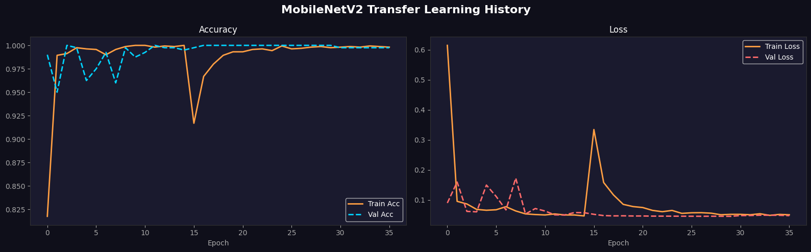
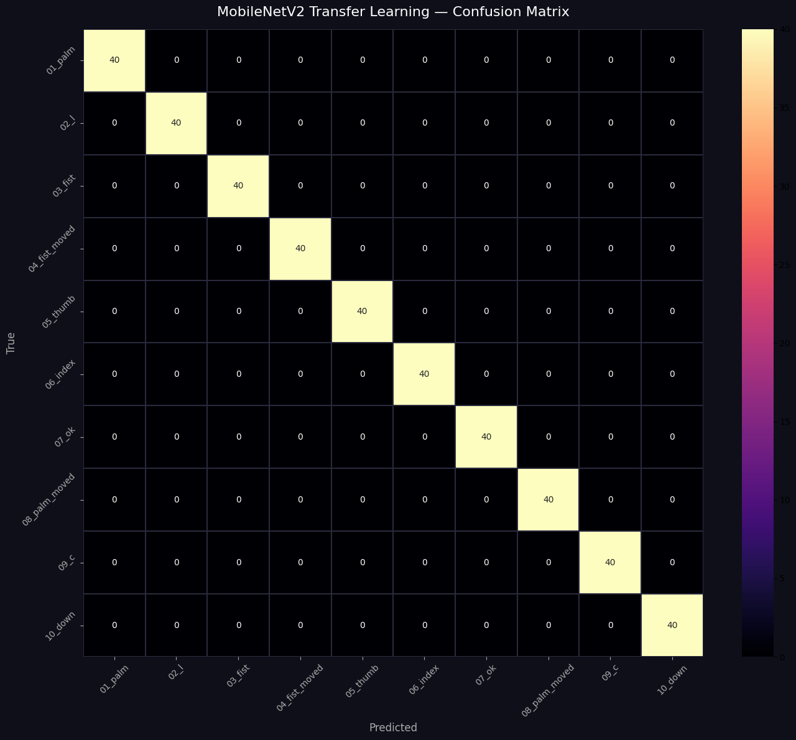
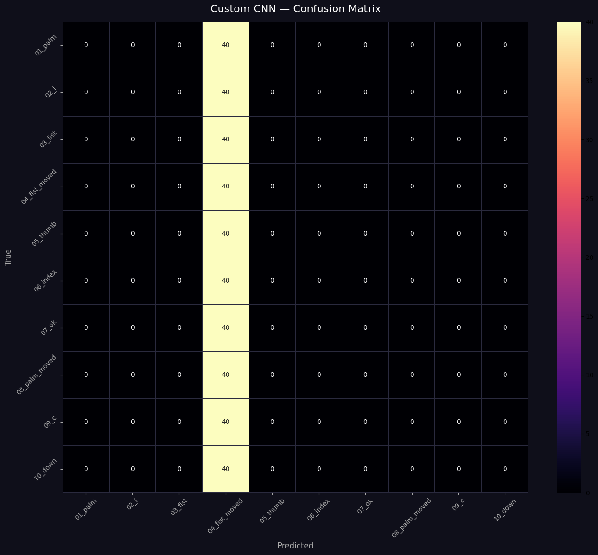
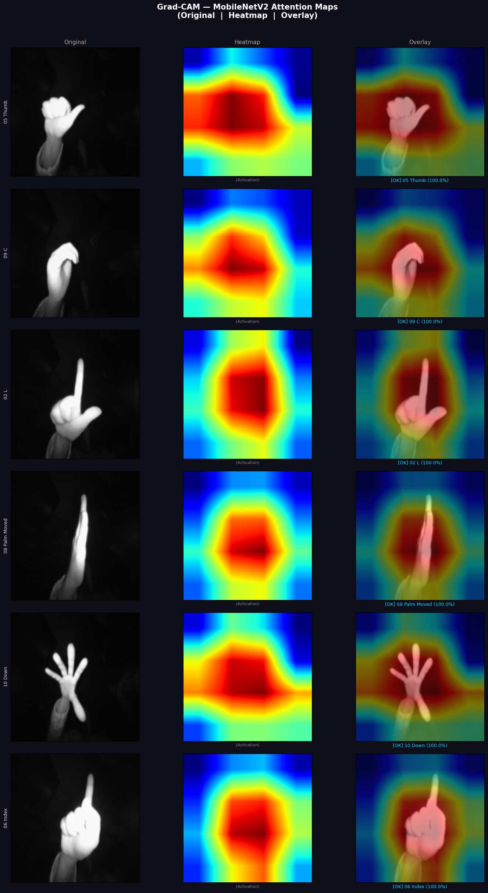

# 🖐️ Hand Gesture Recognition
### Deep Learning · MobileNetV2 Transfer Learning · Grad-CAM · TFLite

A end-to-end hand gesture recognition system built on the [LeapGestRecog](https://www.kaggle.com/datasets/gti-upm/leapgestrecog) dataset. The project trains two models — a custom CNN baseline and a fine-tuned MobileNetV2 — achieving **100% validation accuracy** on 10 gesture classes, with Grad-CAM visualizations for interpretability and a quantized TFLite export for edge deployment.

---

## Results

| Model | Validation Accuracy | Notes |
|---|---|---|
| Custom CNN (baseline) | 10.00% | Collapses to predicting `04_fist_moved` for every sample |
| **MobileNetV2 Transfer Learning** | **100.00%** | RGB input, ImageNet weights, two-phase fine-tuning |

> The custom CNN uses grayscale input and trains from scratch. MobileNetV2 uses RGB input with ImageNet weights and two-phase fine-tuning — the performance gap illustrates the power of transfer learning on a relatively small infrared dataset.

---

## Visualizations

### Training History — MobileNetV2



The combined Phase 1 + Phase 2 training curve (35 epochs total) shows two distinct phases:

- **Epochs 1–15 (Phase 1 — head only):** Validation accuracy jumps to ~100% within the first 2 epochs. Both train and val loss fall rapidly toward zero. Val accuracy fluctuates slightly between epochs 2–10 as the learning rate adjusts, then stabilises near 1.0 by epoch 13.
- **Epoch 15 transition (Phase 2 begins):** A sharp temporary spike in train loss (~0.33) and dip in train accuracy (~0.92) occurs as the top 50 MobileNetV2 layers are unfrozen and the optimizer restarts at lr=1e-5. Validation accuracy is unaffected, confirming the base features were already well-adapted.
- **Epochs 16–35 (Phase 2 — fine-tuning):** Both losses converge smoothly to near zero. Training accuracy catches up to 100% with no sign of overfitting.

---

### Confusion Matrices

#### MobileNetV2 — Perfect Classification



A perfect 10×10 diagonal — every one of the 40 validation samples per class is correctly classified with zero misclassifications across all 10 gesture types. This confirms the 100% validation accuracy is genuine and not an artefact of class imbalance.

#### Custom CNN — Single-Class Collapse



The entire `04_fist_moved` column is lit up — the CNN predicts this class for every single input regardless of the true label. This is a classic symptom of a model that failed to learn discriminative features, caused by:

- Grayscale IR images lacking the colour channels that aid early-layer feature learning
- Training from scratch requiring far more data than is available to generalise across 10 similar hand poses
- The 10% accuracy exactly matching random chance for 10 balanced classes

---

### Grad-CAM Attention Maps



Attention maps are computed on the last `Conv_1` layer of MobileNetV2. A mean-activation fallback is applied automatically for high-confidence predictions where softmax gradients vanish. Red/yellow regions show where the network focuses when classifying each gesture.

*Columns: Original infrared image | Grad-CAM heatmap | Blended overlay*
*Heatmap label shows `(Grad-CAM)` or `(Activation)` depending on which method was used*

---

## Dataset

**LeapGestRecog** — infrared hand images captured with a Leap Motion sensor.

- **Source:** [Kaggle — gti-upm/leapgestrecog](https://www.kaggle.com/datasets/gti-upm/leapgestrecog)
- **Classes (10):**

| # | Class | # | Class |
|---|---|---|---|
| 01 | Palm | 06 | Index finger |
| 02 | L | 07 | OK |
| 03 | Fist | 08 | Palm moved |
| 04 | Fist moved | 09 | C |
| 05 | Thumb | 10 | Down |

- **Image size:** 128 × 128 px
- **Format:** Grayscale infrared (converted to RGB for MobileNetV2)

---

## Project Structure

```
hand-gesture-recognition/
│
├── hand_gesture_recognition.ipynb   # Main Colab notebook
├── class_names.json                 # Ordered list of 10 gesture classes
├── training_report.json             # Accuracy + metadata from training run
│
├── hand_gesture_cnn.keras           # Saved custom CNN
├── hand_gesture_mobilenetv2.keras   # Saved MobileNetV2 model
├── hand_gesture_mobilenetv2.tflite  # Quantized TFLite (edge deployment)
│
├── gradcam_results.png                        # Grad-CAM attention map output
├── mobilenetv2_confusion_matrix.png           # Perfect diagonal — 100% accuracy
├── custom_cnn_confusion_matrix.png            # Single-class collapse visualized
├── mobilenetv2_transfer_learning_history.png  # Loss and accuracy curves
├── sample_gestures.png                        # Dataset sample grid
└── README.md
```

---

## Pipeline

```
Dataset Download (kagglehub)
        │
        ▼
 Data Exploration & Visualization
        │
        ▼
 Preprocessing & Augmentation
 (rotation, flip, zoom, brightness, shear)
        │
        ├──────────────────────────────────┐
        ▼                                  ▼
 Custom CNN (grayscale)        MobileNetV2 Transfer Learning (RGB)
 4 conv blocks + Dense head    Phase 1: train head only
 BatchNorm + Dropout           Phase 2: fine-tune top 50 layers
        │                                  │
        └──────────────┬───────────────────┘
                       ▼
           Evaluation + Confusion Matrix
                       │
                       ▼
              Grad-CAM Visualization
                       │
                       ▼
         TFLite Export (int8 quantized)
```

---

## Model Architectures

### Custom CNN
A 4-block convolutional network trained from scratch on grayscale images:

- **Block 1–3:** Conv2D → BatchNorm → Conv2D → BatchNorm → MaxPool2D → Dropout (32→64→128 filters)
- **Block 4:** Conv2D (256 filters) → GlobalAveragePooling2D
- **Head:** Dense(512) → BatchNorm → Dropout(0.5) → Dense(256) → Dropout(0.3) → Softmax(10)
- **Regularization:** L2(1e-4) on conv and first dense layer
- **Input:** 128×128×1 (grayscale)

### MobileNetV2 + Transfer Learning
Two-phase training on top of ImageNet-pretrained weights:

- **Backbone:** MobileNetV2 (1.00, 128px) — frozen in Phase 1
- **Head:** GlobalAveragePooling2D → Dense(512, relu) → Dropout(0.5) → Dense(256, relu) → Dropout(0.3) → Softmax(10)
- **Phase 1:** Train head only — Adam lr=1e-3, 15 epochs
- **Phase 2:** Unfreeze top 50 layers — Adam lr=1e-5, up to 30 epochs
- **Input:** 128×128×3 (RGB), preprocessed to [-1, 1]

---

## Training Configuration

```python
IMG_HEIGHT   = 128
IMG_WIDTH    = 128
BATCH_SIZE   = 32
EPOCHS_CNN   = 20
EPOCHS_TL    = 30   # Phase 2 fine-tuning
SEED         = 42
```

**Augmentation (training set only):**
- Rotation ±15°, width/height shift ±10%, shear ±10%
- Zoom ±15%, horizontal flip, brightness [0.8, 1.2]

**Callbacks:**
- `EarlyStopping` (patience=6, restore best weights)
- `ReduceLROnPlateau` (factor=0.3, patience=3)
- `ModelCheckpoint` (save best only)

---

## Grad-CAM Implementation

Standard Grad-CAM is computed by building a feature extractor directly from the MobileNetV2 sub-model (not the wrapper model) to avoid Keras 3 graph-boundary errors. For high-confidence predictions where softmax gradients vanish, a **mean absolute activation fallback** is used automatically.

```python
# Automatic method selection
if cam.max() < 0.01:          # gradient vanished
    method = 'Activation'     # mean |feature map| fallback
else:
    method = 'Grad-CAM'       # standard weighted gradient approach
```

---

## Deployment

The best model is exported as a quantized TFLite file for on-device inference:

```python
tl_model.export('hand_gesture_mobilenetv2_export')   # SavedModel dir
converter = tf.lite.TFLiteConverter.from_saved_model('hand_gesture_mobilenetv2_export')
converter.optimizations = [tf.lite.Optimize.DEFAULT]  # int8 quantization
tflite_model = converter.convert()
```

The `.tflite` file can be deployed on **Android**, **iOS**, and **Raspberry Pi / edge devices**.

---

## Requirements & Setup

### Run in Google Colab (recommended)

1. Open `hand_gesture_recognition.ipynb` in [Google Colab](https://colab.research.google.com)
2. Set **Runtime → Change runtime type → T4 GPU**
3. Run all cells — the dataset downloads automatically

### Local setup

```bash
pip install kagglehub tensorflow opencv-python matplotlib seaborn scikit-learn
```

```python
import kagglehub
path = kagglehub.dataset_download("gti-upm/leapgestrecog")
```

**Tested environment:**
- Python 3.12
- TensorFlow 2.20.0
- Keras 3.13.2
- Google Colab (T4 GPU)

---

## Real-Time Webcam Inference

A webcam capture function is included for live gesture prediction directly in Colab:

```python
# Uncomment to run — requires browser camera permission
predict_from_webcam(tl_model, CLASS_NAMES)
```

Captures a single frame, runs inference, and displays a top-3 confidence bar chart.

---

## Environment

```json
{
  "timestamp": "2026-05-15 09:31:46",
  "keras_version": "3.13.2",
  "tensorflow_version": "2.20.0",
  "dataset": "LeapGestRecog (gti-upm)",
  "num_classes": 10,
  "image_size": "128x128",
  "custom_cnn_acc": "10.00%",
  "mobilenetv2_acc": "100.00%"
}
```

---

## License

Dataset: [LeapGestRecog](https://www.kaggle.com/datasets/gti-upm/leapgestrecog) — see Kaggle dataset page for terms.
Code: MIT License.
